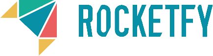
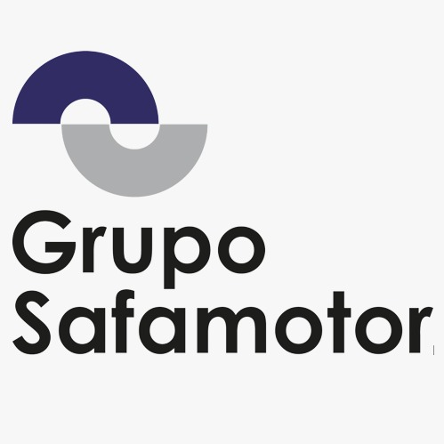

# Proyectos DAM 2022

En este repositorio se encuentra centralizada toda la información relativa a los **Proyectos de Desarrollo de Aplicaciones Multiplataforma del IES Campanillas** (proyectos de fin de ciclo), en la convocatoria del año 2022.

## Requisitos y criterios a seguir

Tanto los criterios generales como los criterios particulares por cada módulo se encuentran en [la Wiki de este repositorio](https://github.com/IESCampanillas/proyectos-dam-2022/wiki).

## Índice a los proyectos de cada alumno

A continuación se listan los enlaces a los repositorios de GitHub donde están los proyectos. 

Cada alumno debe añadir su **apellido** y **nombre** por **orden alfabético** junto con el **título del proyecto**, seguido de un **enlace directo al repositorio** (no a la página de Github del alumno). También se debe indicar si la aplicación está hecha en **Ionic** o es **Android nativo**. Recuerda que, como máximo, podrá haber **8** proyectos de Ionic y **8** proyectos de Android; en otro caso, se desempatará por la fecha del último commit. Actualmente hay:

- **0** Proyectos Ionic disponibles.
- **1** Proyectos Android disponibles.

Cada alumno debe editar este fichero para incluir sus datos. Se ruega respetar el orden de lista.

* Alvarado Díaz, Irene - [CuidaAMiMascota](https://github.com/IreneAlvaradoDiaz/Proyecto-Final---Cuida-a-mi-mascota.git) -ionic
* Buendía López, Jairo - [Task4Home](https://github.com/jairobuendia/ProyectoFinalTask4Home) - Android
* De Abrisqueta Rangel, Ander - [HarenaProjectApp](https://github.com/AnderDeAbrisqueta/HarenaProjectApp) - Ionic
* Estada Cobo, Jose Manuel - [Newsuty](https://github.com/JoseEstradaC/Newsuty-Proyecto) - Android
* Gutierrez Ramirez, Jesús - [GymAndEat](https://github.com/Jesus-GR/GymAndEat)- Ionic
* López Pérez, Cruz - [ClinicaNiloFinalApp](https://github.com/mcruzlp/ClinicaNiloFinalApp.git) - Ionic
* Millán Rebollo, Noel - [Femore](https://github.com/NoelMillan/femore-proyecto) - Ionic && Android
* Morales Aragón, Marcos - [DreamTeam](https://github.com/MarcosMoralesAragon/dreamTeam) - Android
* Rodríguez Barbero Verdera, David - [Matters](https://github.com/Davidrbv/Matters) - Ionic
* Rosales Girón, José Antonio - [MyEntertainmentList](https://github.com/joseantoniorosales/MyEntertainmentList) - Android
* Sevilla Valderrama Fernando - [Invisible Friend](https://github.com/FESEVA/invisibleFriend-project) - Ionic && Android
* Torres Barba, Pedro - [Bravekey](https://github.com/torrespedrob/BraveKey-Android) - Android
* Salmerón Robles, Gonzalo José - [Yummy!](https://github.com/gonzalosalmeron/yummy) - Android
----------------------------------
Convocatoria extraordinaria:
* González Mora, Miguel - [OptiManager 2.0](https://github.com/Miguelgm1693/Proyecto-OptiManager-2.0) (Ionic)
* Zollner Zardi, Henrique - [Genie](https://github.com/henrique2Zs/Genie) (Ionic)
----------------------------------
* Millón Cortés, Manuel Alejandro- [SCA] - Ionic
* López Lozano, Santos - Android
* Fabián El Belaizi, Daniel - [Task Manager](https://github.com/Danny-06/proyecto-integrado) - Ionic

## 🗓️ Fechas a tener en cuenta
* Anteproyecto: lunes 4 de abril
* Revisión (checkpoint): viernes 13 de mayo
* Exposiciones: jueves 23 de junio de 2022

## ⏰ Cuadrante horario de las exposiciones

La duración de cada exposición será de 10 minutos (5 de exposición y 5 de preguntas), dejando un margen de otros 5 minutos para el cambio. Se deberá llegar unos 5 minutos antes del inicio de la presentación. Aquellos alumnos que aún no hayan finalizado su FCT, asistirán al centro únicamente para la exposición, debiendo regresar posteriormente a sus prácticas en la empresa.

### :calendar: jueves 23 de junio de 2022

-woBG.png">

* 08:15h [Gutiérrez Ramírez, Jesús María]()
* 08:30h [López Pérez, María de la Cruz]()
* 08:45h [Buendía López, Jairo]()
* 09:00h [Torres Barba, Pedro]()

* 09:15h [Millán Rebollo, Noel]()

* 09:30h [De Abrisqueta Rangel, Ander]()

* 09:45h [Salmerón Robles, Gonzalo José]()

* 10:00h [Estrada Cobo, José Manuel]()

* 10:15h [Morales Aragón, Marcos]()
* 10:30h [Sevilla Valderrama, Fernando Iván]()

* 10:45h [Rodríguez-Barbero Verdera, David]()

* 11:00h [Alvarado Díaz, Irene]()

* 11:45h [González Mora, Miguel]()

* 11:55h [Zollner Zardi, Henrique]()

## :school: Lugar de las exposiciones

Las presentaciones tendrán lugar en el **salón de actos** de la [**Incubadora**](https://goo.gl/maps/VGMpWnnpCZJQbP21A) sito en C/ Frederik Termann, 3. 29590, PTA.

Mapa ubicación             | 
:-------------------------:|

Si te ha resultado útil este repositorio, por favor dale una :star: ¡Gracias!
